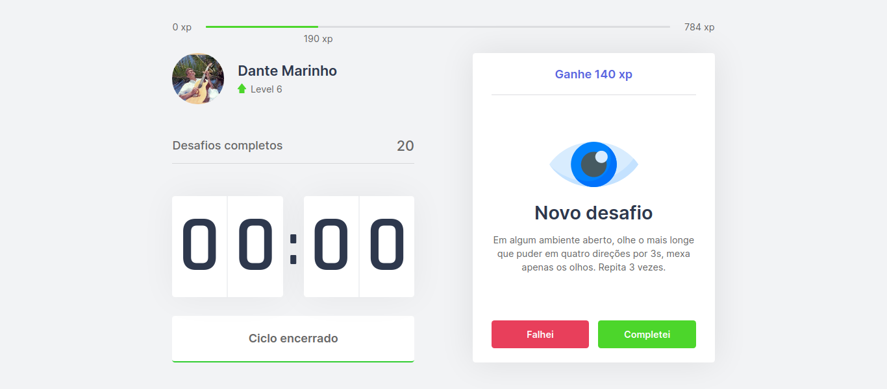
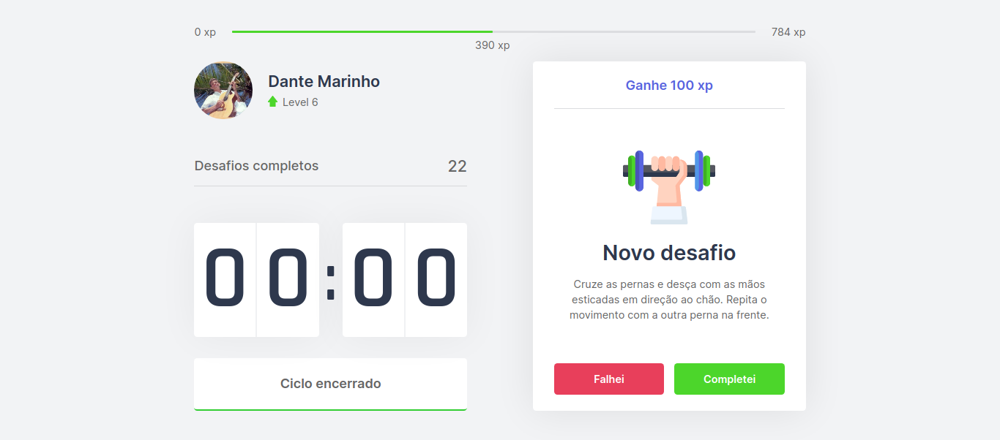
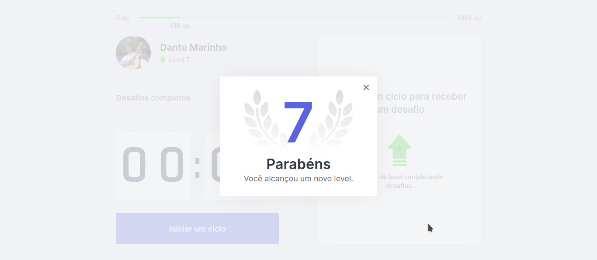

# NLW #04 2021 | Next Level Week » Move-it App

App em produção:  
https://moveit-dantii.vercel.app

Esta aplicação foi desenvolvida no âmbito do evento da Rocketseat, com o foco em Dev Frontend com NextJS.


Um programador pode usá-la para fazer autodesafio de realizar um exercício ocular ou atividade física a cada 25 minutos, onde a cada desafio concluído ganha pontos (XP) e cuida da sua saúde enquanto trabalha.



Os desafios são escolhidos aleatoriamente a partir de um ficheiro JSON.



Quando atinge uma determinada pontuação, o user aumenta o level, onde é informado através de um modal.



## Como rodar a app numa máquina local

- Download da app
- Instalar as dependências com `npm install`
- Rodar o servidor de desenvolvimento:
    ```bash
    npm run dev
    # or
    yarn dev
    ```
- Aceder a app em [http://localhost:3000](http://localhost:3000) através do browser para ver o resultado.

## Como utilizar a app

Quando um programador inicia uma jornada de trabalho, poderá fazer uso da app para que a cada 25 minutos lhe seja sorteado um desafio para realizar. Para isso, deverá iniciar um ciclo no botão `Iniciar um ciclo`. Ao finaliar esse tempo, deverá realizar o desafio e caso o tenha feito deverá confirmar no botao `Completei`, e então repetir este ciclo.

**Dica para testar a app:**  
Altere o tempo do ciclo para um tempo menor, por exemplo 6 segundos, para que possa chegar rapidamente a um desafio ou a uma subida de nível. Para isso, altera o finheiro `contexts/Countdown.tsx`, configurando o valor da constante `cicle`, na linha 25:

Valor padrão:
```tsx
const cicle = 25 * 60
```

Altere para:
```tsx
const cicle = 0.1 * 60
```

---

## Anotações durante o evento

Anotações dos principais pontos e conceitos da trilha React.

### Desvendando o Next.js

- SPA - Single Page Application
- SSR - Server Side Rendering
- SSG - Static Site Generation

SPA  
O browser precisa de ter o JavaScript abilitado para funcionar. Melo indicado para apps com acesso fechado.

SSR  
Modelo indicado para sites e blogs públicos, pois possibilita a otimização SEO, sendo o conteúdo do site lido pelos crowlers.

SSG  
Modelo útil para aplicar a página que não precisam de ser atualizadas constantemente. Neste caso é indicado para que seja criado um cache com a página, impedindo que seja sempre buscado o mesmo conteúdo ao backend. Indicado para sites com grande volume de acesso e baixa necessidade de alteração constante do conteúdo.

## Setup inicial do projeto Next com TypeScript

A app foi criada com os comandos:

- `npx create-next-app moveit-next`
- `npm install typescript @types/react @types/react-dom @types/node -D`
- Alterar as extensões `.js` para `.tsx`.
- Criação da pasta `src` na raiz do projeto e deixar a estrutura inicial desta forma:
```
-- src
    -- components
    -- pages
        -- _app.tsx
        -- _document.tsx
        -- index.tsx
    -- styles
```

## Manipular o Document

Podemos mexer na estrutura do documento HTML de um projeto Next, através da criação de um arquivo `pages/_document.tsx`.

O _document.tsx carrega uma única vez na visita do user, sendo útil então para colocar no `head` tudo o que for estático e precisa ser reaproveitado na app. 

```tsx
import Document, { Html, Head, Main, NextScript } from 'next/document'

// O _document.txs carrega apenas uma única vez numa visita de um user

export default class MyDocument extends Document {
    render() {
        return (
            <Html>
                <Head>
                    <link rel="shortcut icon" href="favicon.png" type="image/png" />

                    {/* Google Fonts */}
                    <link rel="preconnect" href="https://fonts.gstatic.com" />
                    <link href="https://fonts.googleapis.com/css2?family=Inter:wght@400;500;600&family=Rajdhani:wght@600&display=swap" rel="stylesheet" />
                </Head>
                <body>
                    <Main /> {/* Lugar onde fica a app */}
                    <NextScript />
                </body>
            </Html>
        )
    }
}
```

Formas de adicionar tags <link ... /> ao Next.
- Através do <Head> dentro de cada página.
- Através do <Head> dentro de do _app.js para compartilhar com as outras páginas.
- Através do _document.tsx (funcionalidade do Next), podendo mexer na estrutura do documento HTML.

### Context API - API de Contextos do React

Contextos: formas de fazer comunicação entre vários componentes da app. Ou seja, serve para ter acesso a uma informação a partir de vários lugares.

Na app movit-next, o Context API foi utilizado para que o componente Countdown pudesse se comunicar com o componente ChallengeBox.

**Estrutura básica de um Contect API:**

// --- CountdownContext.tsx

```tsx
import { createContext, ReactNode } from "react";

interface CountdownContextData {

}

// type ou interface :: para tipar o "children"
interface CountdownProviderProps {
    children: ReactNode
}

const CountdownContext = createContext({} as CountdownContextData)

export function CountdownProvider({ children }: CountdownProviderProps) {
    return (
        <CountdownContext.Provider value={{}}>
            {children}
        </CountdownContext.Provider>
    )
}
```

#### Exemplo de Config **básica** de um fluxo do Context API


// --- context/MyContext.tsx


```tsx
import { createContext } from 'react'

// For TypeScript use
interface ContextValues {
    fullName: string
    age: 37
}

// Criando um contexto
export const MyContext = createContext({} as ContextValues)
```


// --- pages/_app.tsx


```tsx
import '../styles/global.css'
import { MyContext } from '../contexts/MyContext'

function MyApp({ Component, pageProps }) {
    return (
        <MyContext.Provider value={{ fullName: "Dante Marinho", age: 37 }}>
            <Component {...pageProps} />
        </MyContext.Provider >
    )
}

export default MyApp
```


// --- pages/index.tsx


```tsx
import Head from 'next/head'
import { useContext } from 'react'
import { MyContext } from '../contexts/MyContext'

export default function Home() {

    const { fullName, age } = useContext(MyContext)
    console.log(fullName, age) // Will print "Dante Mrainho 37"

    return (
        <div className={styles.container}>
            <Head>
                <title>Início | My App</title>
            </Head>

            <MyComponent />

            <section>
                <p>Hello World! I'm {fullName}, {age} years old.</p>
            </section>
        </div>
    )
}
```

#### Exemplo de Config mais **aprimorada** de um fluxo do Context API

Nesta opção, em vez de criarmos funções e estados em _app.tsx, concentramos todas estas implementações em outro ficheiro, neste caso, no mesmo ficheiro onde criamos o contexto (pages/MyContext.tsx).

// --- context/MyContext.tsx


```tsx
import { createContext, ReactNode, useState } from 'react'

// For TypeScript use
interface ContextValues {
    fullName: string
    age: 37
    sallary: number
    sayHello: () => void
    moreMoney: (value: number) => void
}

// Criando um contexto
export const MyContext = createContext({} as ContextValues)

// type ou interface :: para tipar o "children"
interface MyProviderProps {
    children: ReactNode
}

export function MyContextProvider({ children }: MyProviderProps) {
    // Put here some states or funcions
    const [sallary, setSallary] = useState(1500)

    function sayHello() {
        console.log('Helooo!!')
    }

    function moreMoney(value: number) {
        setSallary(sallary + value)
    }

    return (
        <MyContext.Provider value={{ fullName: "Dante Marinho", age: 37, sallary, sayHello, moreMoney }}>
            {children}
        </MyContext.Provider>
    )
}
```


// --- pages/_app.tsx


```tsx
import '../styles/global.css'
import { MyContextProvider } from '../contexts/MyContext'

function MyApp({ Component, pageProps }) {
    return (
        <MyContextProvider>
            <Component {...pageProps} />
        </MyContextProvider >
    )
}

export default MyApp
```


// --- pages/index.tsx


```tsx
import Head from 'next/head'
import { useContext } from 'react'
import { MyContext } from '../contexts/MyContext'

export default function Home() {

    const { fullName, age, sayHello, sallary, moreMoney } = useContext(MyContext)
    console.log(fullName, age) // Will print "Dante Mrainho 37"
    sayHello() // Will print "Hellooo!!"

    return (
        <div className={styles.container}>
            <Head>
                <title>Início | My App</title>
            </Head>

            <p>Actual sallary: {sallary}</p>
            <button onClick={() => moreMoney(500)}>Get more 500€</button>

            <MyComponent />

            <section>
                <p>Hello World! I'm {fullName}, {age} years old.</p>
            </section>
        </div>
    )
}
```

## JS Cookie

Os cookies podem ser armazenados tanto no server quanto no client

- js-cookie :: lib JS pura, com uma API amigável para buscar e escrever dados no cookie.
- @types/js-cookie :: lib de terceiro que adiciona typagem a libs que não foram feitas com TypeScript, então ajuda no intellicense do editor.

**Installation**
```
npm i js-cookie
npm i @types/js-cookie -D
```

```tsx
// Uso de cookies para armazenar o level, current-experience e o challengesCompleted
// O useEffect() faz o trigger de sempre observe alguma alteração nas variáveis passadas no array, escreve os novos valores para os cookies
useEffect(() => {
    Cookies.set('level', String(level))
    Cookies.set('currentExperience', String(currentExperience))
    Cookies.set('challengesCompleted', String(challengesCompleted))
}, [level, currentExperience, challengesCompleted])
```

## Criação e funcionamento da modal

// --- LevelUpModal.tsx

```tsx
import { useContext } from 'react'

import { ChallengesContext } from '../contexts/ChallengesContext'
import styles from '../styles/components/LevelUpModal.module.css'

export function LevelUpModal() {
    const { level, closeLevelUpModal } = useContext(ChallengesContext)
    return (
        <div className={styles.overlay}>
            <div className={styles.container}>
                <header>{level}</header>
                <strong>Parabéns</strong>
                <p>Você alcançou um novo level.</p>

                <button type="button" onClick={closeLevelUpModal}>
                    
                </button>
            </div>
        </div>
    )
}
```

// --- LevelUpModal..codule.css

```tsx
.overlay {
    background: rgba(242, 243, 245, 0.8);
    position: fixed;
    top: 0;
    bottom: 0;
    left: 0;
    right: 0;

    display: flex;
    justify-content: center;
    align-items: center;
}

.container {
    background: var(--white);
    width: 100%;
    max-width: 400px;
    padding: 2rem 3rem;
    border-radius: 5px;
    box-shadow: 0 0 60px rgba(0,0,0,0.05);
    text-align: center;
    position: relative;
}

.container header {
    font-size: 8.75rem;
    font-weight: 600;
    color: var(--blue);
    background: url('/icons/levelup.svg') no-repeat center;
    background-size: contain;
}

.container strong {
    font-size: 2.25rem;
    color: var(--title);
}

.container p {
    font-size: 1.25rem;
    color: var(--text);
    margin-top: 0.25rem;
}

.container button {
    position: absolute;
    right: 0.5rem;
    top: 0.5rem;
    background: transparent;
    border: 0;
    font-size: 0;
}
```

// --- ChallengesContext.tsx

```tsx
import { LevelUpModal } from '../components/LevelUpModal'

(...)

export function ChallengesProvider({ children, ...rest }: ChalllengesProviderProps) {

    (...)

    const [isLevelUpModalOpen, setIsLevelUpModalOpen] = useState(false)

    function levelUp() {
        setLevel(level + 1)
        setIsLevelUpModalOpen(true)
    }

    function closeLevelUpModal() {
        setIsLevelUpModalOpen(false)
    }

    return (
        <ChallengesContext.Provider value={{
            level,
            currentExperience,
            experienceToNextLevel,
            challengesCompleted,
            levelUp,
            startNewChallenge,
            activeChallenge,
            resetChallenge,
            completeChallenge,
            closeLevelUpModal
        }}>
            {children}
            {isLevelUpModalOpen && <LevelUpModal />}
        </ChallengesContext.Provider>
    )
}

```

## Deploy da App React

Opções de plataformas com planos free:
- Netlify
- Vercel

### Deploy na Vercel

Live app:  
https://moveit-dantii.vercel.app

- Criar conta na Vercel
- Download Vercel CLI `npm i -g vercel`
  Se instalar pelo yarn, precisa configurar yarn (yarn global path)
  `vercel login`
  A partir da pasta raiz da app:
  ```
    dantiii@dantiii-neon:~/Desktop/Eventos/NLW 2021-02-18/movit-next$ vercel
    Vercel CLI 21.3.3
    ? Set up and deploy “~/Desktop/Eventos/NLW 2021-02-18/movit-next”? [Y/n] y
    ? Which scope do you want to deploy to? Dante Marinho
    ? Link to existing project? [y/N] n
    ? What’s your project’s name? moveit-dantii
    ? In which directory is your code located? ./
    Auto-detected Project Settings (Next.js):
    - Build Command: `npm run build` or `next build`
    - Output Directory: Next.js default
    - Development Command: next dev --port $PORT
    ? Want to override the settings? [y/N] n
    🔗  Linked to dantiii/moveit-dantii (created .vercel)
    🔍  Inspect: https://vercel.com/dantiii/moveit-dantii/EY9fsCb7Q3ATjqxDJv217SvK8CHR [1s]
    ✅  Production: https://moveit-dantii.vercel.app [copied to clipboard] [38s]
    📝  Deployed to production. Run `vercel --prod` to overwrite later (https://vercel.link/2F).
    💡  To change the domain or build command, go to https://vercel.com/dantiii/moveit-dantii/settings
  ```
- A fazer nova modificação no projeto basta rodar o comando `vercel`, mas desta vez irá criar um novo link provisório para testes. 
- Para mandar novamente para produção basta rodar o comando `vercel --prod`.

## Ideias de melhorias e features para a app

- Adicionar boa documentação, com imagens
- Tornar responsiva
- Integração com PWA
- Logar com Github (OAuth) :: O Next faz isso sem a necessidade de ter que usar um backend. Ver este vídeo:  
  Serverless com ReactJS e Next.js na Vercel | Code/Drops #54  
  https://www.youtube.com/watch?v=Cz55Jmhfw84

Figma com mais ideias para incrementar no projeto  
https://www.figma.com/file/2cp7thFOmNRqoeYJ3u11C0/Move.it-2.0

Inscrição para o Ignite: "_Currículo alinhado com o mercado e as atitudes que vão te ajudar a acelerar na direção dos seus objetivos como dev._"  
https://pages.rocketseat.com.br/ignite/pre-matriculas/15
